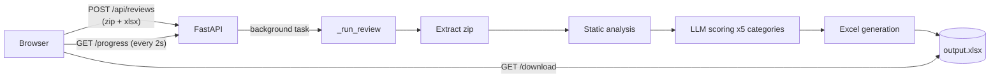
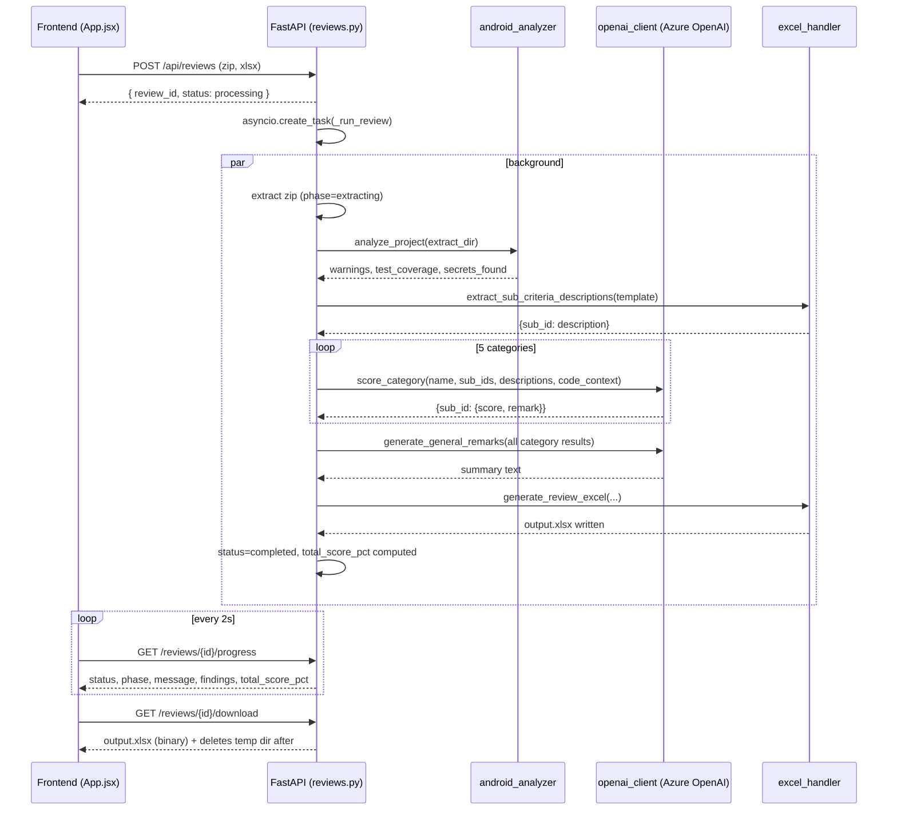

# Android Code Review Automation — Technical README

This document explains **how the system actually works today**: the exact path a request takes from file upload to a scored Excel workbook, how the backend/frontend modules talk to each other, and how the LLM prompts are built. It reflects the current code (`backend/app/**`, `frontend/src/**`), not the original planning docs (`HANDOVER_ANDROID_CODE_REVIEW.md`, `QUICK_REFERENCE.md`), which describe the pre-implementation design and have since drifted from reality in places (e.g. no WebSocket endpoint exists; polling is HTTP only).

## 1. Overview

A user uploads an Android project (`.zip`) and a scoring template (`.xlsx`). The backend extracts the project, statically analyzes it (structure, secrets, dependency versions, test coverage), asks an LLM to score each review category against the *actual template wording*, then writes the scores back into a copy of the uploaded template while preserving its formatting. The frontend polls a progress endpoint and renders live status until a populated workbook is ready to download.



## 2. End-to-end data flow

All of this happens inside `backend/app/api/reviews.py`.

### Step 0 — Request arrives (`POST /api/reviews`)
- Two files come in as `multipart/form-data`: `androidZip`, `excelTemplate`.
- A `review_id` (`uuid4`) is minted and a fresh state dict (`_new_review_state()`) is stored in the in-memory `_reviews` dict — there is no database; state lives only in the process.
- Both uploads are written to a per-review temp directory (`tempfile.mkdtemp`).
- The actual work is **not** awaited here — `asyncio.create_task(_run_review(...))` fires it in the background, and the endpoint immediately returns `{review_id, status: "processing"}`. (`status: "error"` from this endpoint only happens if *saving the upload itself* fails, e.g. disk full — a rare, separate path from the review pipeline's own errors.)

### Step 1 — Extract (`phase: "extracting"`, progress → 20)
`zipfile.ZipFile(...).extractall(extract_dir)`. Nothing sophisticated here; the extracted tree is what every later phase reads from.

### Step 2 — Analyze (`phase: "analyzing"`, progress → 50)
`android_analyzer.analyze_project(extract_dir)` runs four independent checks and bundles them into one `AnalysisResult`:

| Sub-check | Function | What it does |
|---|---|---|
| Structure | `validate_project_structure` | Warns if `build.gradle`/`AndroidManifest.xml` are missing; **fatal error** if no `.java`/`.kt` files exist at all (this is the one case that aborts the whole review) |
| Gradle/SDK parsing | `parse_gradle` + `find_gradle_file` | Regexes the app module's `build.gradle(.kts)` for `compileSdk`, `targetSdk`, Gradle plugin version, Kotlin version, dependency coordinates, and whether JaCoCo/Kover are configured |
| Version staleness | `version_checker.compare_versions` | Compares parsed versions against a hardcoded "latest" table (`compileSdk 34`, `targetSdk 34`, Gradle 8.0+, Kotlin 1.9+) and emits warning strings — never fatal |
| Test coverage | `detect_test_coverage` | Only looks if JaCoCo/Kover was detected; finds a `*jacoco*.xml` report anywhere in the tree and computes `covered / (covered + missed) * 100` from the `INSTRUCTION` counter |
| Secrets | `secrets_scanner.scan_directory` | Regex-scans every `.java/.kt/.xml/.properties/.gradle/.kts` file line-by-line for API-key/AWS-secret/generic-token/Firebase-key patterns, recording `{file, line, pattern}` |

The results land directly on the review's `state` dict — `warnings`, `test_coverage`, `secrets_found` — which is why the frontend's findings grid can start rendering **mid-review**, before scoring or generation even start.

In the same phase, the uploaded template is opened (`load_workbook`) and `excel_handler.extract_sub_criteria_descriptions(ws, CATEGORIES)` pulls each sub-criterion's **actual description text** out of the template (the column next to the id column). This is what grounds the LLM prompt in the real rubric instead of a bare id like `"2.4"`.

### Step 3 — Score (`phase: "scoring"`, progress 50 → 80)
For each of the 5 hardcoded categories (see §5), `openai_client.score_category(...)` is called once, sequentially, against the **same** gathered code context (`android_analyzer.gather_code_context`, all `.java`/`.kt` files concatenated up to a 32,000-char budget, sorted by path for determinism). `state["message"]` is updated per category (`"Evaluating <category name>..."`) so the frontend's active-step subtext shows granular progress. Each category's raw sub-scores are immediately reduced via `aggregate_category_scores` (§6).

### Step 4 — Generate (`phase: "generating"`, progress 90 → 100)
- `generate_general_remarks(scores_by_category)` — one more LLM call, given every sub-criterion's score+remark, asking for a 2-3 sentence overall summary.
- `generate_review_excel(...)` opens a **fresh copy** of the original template and writes scores, remarks, and metadata into it (§7) without touching any existing formatting or formulas, then saves it as `output.xlsx` in the review's temp dir.
- `state["download_path"]` is set, `status` flips to `"completed"`, `total_score_pct` is computed (mean of every category's `percent_points`).

### Cleanup
In the `finally` block, the extracted source tree and the two original uploads are always deleted. The work dir (containing `output.xlsx`) is only deleted immediately if the run **failed** to produce output; otherwise it survives until `GET /api/reviews/{id}/download` serves the file once, at which point a `BackgroundTask` deletes the whole work dir right after the response streams.

### Polling contract
`GET /api/reviews/{review_id}/progress` returns a full snapshot every time — `status`, `phase`, `progress`, `message`, `stats`, `download_url` (non-null only once completed), `error`, `warnings`, `test_coverage`, `secrets_found`, `total_score_pct`. The backend never pushes; the frontend polls this every 2 seconds until `status !== "processing"`.

## 3. Sequence diagram



## 4. Backend module map

```
backend/
  main.py                          FastAPI app, CORS (locked to localhost:3000), /api/health
  app/api/reviews.py                All 3 review endpoints + the _run_review orchestrator + CATEGORIES
  app/analyzer/
    android_analyzer.py             Structure validation, gradle parsing, coverage detection, code-context gathering
    version_checker.py              Pure function: gradle_info -> staleness warnings
    secrets_scanner.py               Pure function: directory -> secret findings
    openai_client.py                 Stub/live scoring + general-remarks LLM calls, prompt construction
    excel_handler.py                 Score/metadata aggregation + positional Excel writing
  app/utils/logger.py                Structured logger used for exception logging in reviews.py
```

`reviews.py` is the only module that talks to all the others — `android_analyzer`, `openai_client`, and `excel_handler` don't import each other; `reviews.py` sequences their outputs into inputs (e.g. `analyze_project`'s `gather_code_context` output becomes `score_category`'s last argument; `score_category`'s output becomes `aggregate_category_scores`'s input; that becomes `generate_review_excel`'s input). `android_analyzer` itself composes `secrets_scanner` and `version_checker` internally.

## 5. The 5 review categories

Hardcoded in `reviews.py` (note: ids skip "5" — the real template numbers this category "6"):

```python
CATEGORIES = {
    "1": {"name": "Code naming conventions / Code Structure", "sub_criteria": ["1.1", ..., "1.6"]},
    "2": {"name": "Reliability, Security & Observability",    "sub_criteria": ["2.1", ..., "2.4"]},
    "3": {"name": "Delivery Discipline & Architecture",       "sub_criteria": ["3.1", ..., "3.4"]},
    "4": {"name": "AI Usage & Code Ownership",                "sub_criteria": ["4.1", ..., "4.3"]},
    "6": {"name": "Safe & Integrated AI Code",                "sub_criteria": ["6.1", "6.2", "6.3"]},
}
```

Each category triggers exactly one `score_category(...)` call (5 total per review), plus one final `generate_general_remarks(...)` call — 6 LLM calls per full review in live mode.

## 6. Prompt generation

`openai_client.py` never sends a bare sub-criterion id to the model — it always grounds the prompt with the **template's own wording**, pulled by `excel_handler.extract_sub_criteria_descriptions` earlier in the pipeline.

### 6.1 Category scoring prompt (`_live_score`)

```python
criteria_lines = "\n".join(f"{sub_id}: {descriptions.get(sub_id, '')}" for sub_id in sub_criteria)

system_prompt = (
    f"You are an expert Android code reviewer. Score the following {category_name} "
    "sub-criteria based ONLY on the provided code snippet:\n"
    f"{criteria_lines}\n\n"
    "For each sub-criterion, score 0 (fails), 0.5 (partial), 1 (meets it), or null if the "
    "code snippet does not contain enough information to judge that specific sub-criterion "
    "(e.g. it asks about PR comments, commit history, or other context not present in "
    "source code -- do not guess or assume in that case, use null). "
    "Each remark must be specific to its own sub-criterion's exact wording above, not a "
    "general comment about the code as a whole or about a different sub-criterion.\n"
    'Respond as JSON: {"<id>": {"score": <num or null>, "remark": "<1-2 sentences>"}, ...}'
)
```

- **System message**: the prompt above (category name + every one of its sub-criteria's real description text + the scoring rubric + response-shape instruction).
- **User message**: `gather_code_context(...)` — the concatenated `.java`/`.kt` source (same 32K-char blob reused for all 5 categories; not re-gathered per category).
- Sent with `temperature: 0.3`, `max_tokens: 1500`, `response_format: {"type": "json_object"}` to Azure's chat-completions endpoint, retried up to 3x with exponential backoff on HTTP 429.
- The parsed JSON is passed through `_normalize_score_result`, which **rebuilds the dict in the exact order/completeness of the requested `sub_criteria` list** — regardless of what order or subset the model actually returned. This matters because `excel_handler.populate_scores` later writes scores into the spreadsheet **positionally** (row N = the Nth sub-criterion), so a model that reorders, skips, or invents a key would otherwise silently misalign every row after the first discrepancy.

### 6.2 General remarks prompt (`_live_general_remarks`)

```python
system_prompt = (
    "You are an expert Android code reviewer. Given per-criterion scores and remarks "
    "from a completed code review, write a concise 2-3 sentence overall summary of the "
    "code quality, highlighting the weakest areas. Respond with plain text only, no JSON."
)
```

- **User message**: `_build_findings_summary(category_results)` — every sub-criterion across every category rendered as `"<id>: score=<n>, remark=<text>"`, one per line.
- Plain-text response (no JSON mode), `max_tokens: 300`.

### 6.3 Stub mode

If `AZURE_OPENAI_KEY` isn't set (`is_stub_mode()`), no network calls happen at all: every sub-criterion gets `score: 1` with a `"[STUB] No Azure OpenAI key configured..."` remark, and general remarks becomes a fixed stub string. This is what the backend's integration test runs against, and it's why a fully-scored review with no Azure credentials always comes out at `total_score_pct == 100.0`.

## 7. Score aggregation & Excel writing

- `aggregate_category_scores(sub_scores)` — averages the category's non-null sub-scores (0/0.5/1 scale) into `avg_points`, sets `final_points = avg_points` (weighting is currently 1:1 across categories), and `percent_points = avg_points * 100`.
- `compute_total_score_pct(scores_by_category)` — the mean of every category's `percent_points` that isn't `None`; `None` if no category scored at all. This is the number shown as the "Total X%" tag on the frontend's completed screen.
- `populate_scores(ws, category_results)` writes each sub-criterion's score into the `Avg Points` column and its remark into `Remarks` — but **only** writes a remark when `score != 1` (perfect scores are self-explanatory; a stale remark from a previous run against the same template is explicitly cleared, not just skipped). Rows are located by walking the sheet positionally (`_iter_positional_sub_rows`): whichever row's id cell matches a known category id, the next N rows are treated as that category's sub-criteria — this tolerates the real template's blank/typo'd sub-row id cells. Category-level rollup formulas (`=AVERAGE(...)`, `=D3*C3`, etc.) are detected (`_is_formula_cell`) and never overwritten; Excel recalculates them itself when the file is opened.
- `populate_metadata(...)` fills project name, general remarks, reviewer name, and date by searching for label text (e.g. a cell whose value starts with `"general remarks"`) rather than fixed coordinates, so minor template drift between versions doesn't break it.

## 8. Frontend module communication

```
frontend/src/
  App.jsx                 Owns the state machine: idle -> uploading -> polling -> completed | error
  components/
    UploadForm.jsx          Client-side extension validation; disabled until both files chosen
    ProgressTracker.jsx      Polls GET /progress every 2s; maps backend `phase` -> one of 4 step indices
    FindingsPanel.jsx        3-card grid (warnings/coverage/secrets); expandable lists
    StatsDisplay.jsx         Completed screen: score/warning/secret tags, download link, timing table
  services/api.js            createReview(), getProgress(id), getDownloadUrl(path) — the only HTTP boundary
```

- `App.jsx` never talks to the backend directly except via `services/api.js`. It owns `progressData` (the raw poll response) and hands slices of it down as props — `ProgressTracker` gets `reviewId`/`onUpdate`, `FindingsPanel` gets `warnings`/`testCoverage`/`secretsFound`, `StatsDisplay` gets everything needed for the completed screen (including re-rendering its own nested `FindingsPanel`).
- Phase → step mapping (`ProgressTracker.jsx`): `pending` → all steps pending; `extracting`/`analyzing`/`scoring`/`generating` → that step active, earlier ones done; `completed`/`error` → all done. The backend's live `message` (e.g. `"Evaluating Reliability, Security & Observability..."`) renders as subtext under whichever step is active — this is how per-category scoring progress surfaces without a numeric bar.
- `services/api.js` resolves its base URL from `REACT_APP_API_URL` (defaults to `http://localhost:8000/api`) and derives the origin for `getDownloadUrl` by stripping `/api` — so it can combine the origin with whatever `download_url` path the backend returns without doubling `/api`.

## 9. API contract

```
POST   /api/reviews
  multipart/form-data: androidZip (file), excelTemplate (file)
  -> 200 { review_id, status: "processing" | "error" }

GET    /api/reviews/{review_id}/progress
  -> 200 {
       status: "processing" | "completed" | "error",
       phase: "pending" | "extracting" | "analyzing" | "scoring" | "generating" | "completed" | "error",
       progress: number (0-100),
       message: string,
       stats: { ingest_time_ms?, analysis_time_ms?, scoring_time_ms?, generation_time_ms?, total_time_ms? },
       download_url: string | null,
       error: string | null,
       warnings: string[],
       test_coverage: number | null,
       secrets_found: { file, line, pattern }[],
       total_score_pct: number | null,
     }

GET    /api/reviews/{review_id}/download
  -> 200 binary xlsx (deletes the review's temp dir after serving)
  -> 404 if not ready or already downloaded

GET    /api/health
  -> 200 { status: "ok", azure_openai_connected: boolean }
```

The backend **always returns HTTP 200** for review-pipeline errors — failures are carried in the response body (`status: "error"`, `error: "<message>"`), never as a non-2xx status. The frontend must (and does) check `status`/`error` in the body rather than the HTTP status code.

## 10. Running it

**Docker (recommended):**
```bash
docker compose up -d --build   # --build is required after any code change —
                                # the frontend image is a static production build,
                                # not a dev server with hot-reload
```

**Locally:**
```bash
# backend
cd backend && source venv/bin/activate
uvicorn main:app --reload --host 0.0.0.0 --port 8000

# frontend (separate terminal)
cd frontend && npm start
```

Without `AZURE_OPENAI_KEY` set, the backend runs in stub mode end-to-end — useful for exercising the full pipeline (extraction, analysis, Excel writing, frontend states) without hitting Azure OpenAI at all.
